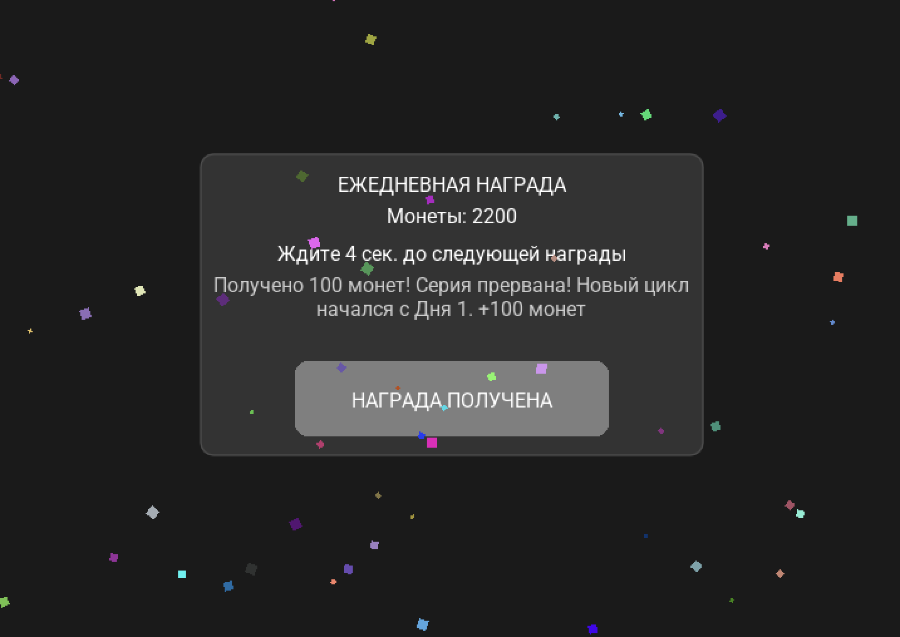

# Тестовое задание: Full Stack Developer (Node.js + PostgreSQL + Lua)

## Контекст
Необходимо с нуля реализовать backend на Node.js, базу данных PostgreSQL и простой клиент на Lua (движок Defold или LÖVE). Задача — собрать минимально рабочую клиент-серверную механику, похожую на реальную игровую фичу.

## Описание механики Daily Rewards
Daily Rewards — это система ежедневных наград. Игрок получает награду за последовательные входы.

- День 1 → 100 монет
- День 2 → 200 монет
- День 3 → 300 монет
- ...
- День 7 → 1000 монет

После 7 дней цикл либо начинается заново, либо фиксируется (см. `CYCLE_BEHAVIOR` ниже).

## Упрощение для тестов
Награду можно получать раз в 5 минут:
- прошло < 5 минут → получать нельзя
- прошло ≥ 5 минут → можно
- прошло > 10 минут → серия сбрасывается (пример)

## Backend (Node.js + PostgreSQL)

### Запуск сервера в Docker
- **Требования**: Docker + Docker Compose

```bash
cd server
cp env.example .env
docker compose up --build
```

- **Режимы для тестов / для реального использования**: параметры меняются в `server/.env`
  - **Тестовый режим (быстро проверять руками)**:
    - `REWARD_COOLDOWN_SEC=5` — можно получать награду раз в 5 секунд
    - `REWARD_STREAK_RESET_SEC=20` — если пропустить 20 секунд, серия сбрасывается
  - **Реальный режим (как в “настоящем” daily)**:
    - `REWARD_COOLDOWN_SEC=86400` — можно получить награду снова только через сутки
    - `REWARD_STREAK_RESET_SEC=172800` — если прошло больше 2 суток, серия сбрасывается

- **`CYCLE_BEHAVIOR` (что делать после Дня 7)**:
  - `reset` — после получения Дня 7 следующая доступная награда снова будет **День 1** (серия начинается заново)
  - `fixed` — после получения Дня 7 серия **не продолжается/не сбрасывается сразу**: повторно “фармить” День 7 нельзя, следующая серия начнётся только после таймера сброса

- **Проверка**:

```bash
curl -s http://localhost:3000/health
```

### Auth
**POST /auth/guest**  
возвращает user_id и token.

### Получение состояния наград
**GET /daily-rewards**  
возвращает текущее состояние.

### Получение награды
**POST /daily-rewards/claim**  
выполняет получение награды.

### Логика
- 7-дневный цикл
- получение строго по порядку
- нельзя получить дважды
- сервер контролирует время
- при пропуске серия сбрасывается

## Клиент (Lua / LÖVE)
### Запуск клиента
- **Требования**: установлен LÖVE (love2d)
- **Если LÖVE не установлен**:
  - **macOS (Homebrew)**: `brew install love`
  - **Windows**: установить с сайта `https://love2d.org/`
  - **Linux**: поставить пакетом дистрибутива (например, `sudo apt install love` / `sudo pacman -S love`)
- **Важно**: сервер должен быть доступен на `http://localhost:3000` (см. запуск сервера выше)

```bash
cd client
love .
```

На каждый запуск — свой user_id (получаем от сервера).

Клиент отображает:
- кнопку получения награды (всегда доступна)
- статус (можем получить / не можем / почему)

При нажатии на кнопку получения показывает результат (сколько монет дали) либо почему не смогли получить (что сервер вернул).

## Unit tests
Логику нужно покрыть юнит-тестами (объем на усмотрение кандидата).

## Ожидаемый результат
В виде ссылки на GitHub:
- backend
- клиент
- SQL / миграции
- unit tests
- README
